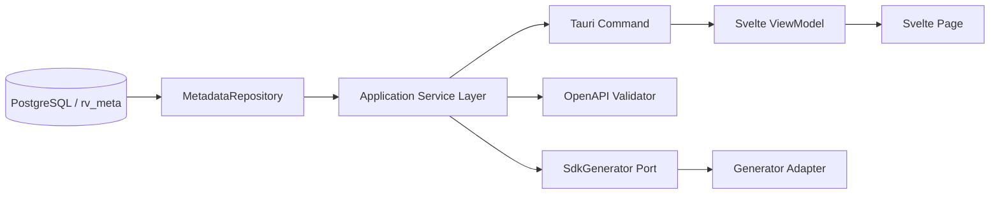

# Operation Group / Function Operation表示 / SDK Generator変更仕様

## ステータス

rv-metaの[Operation Group / Function Operation / OpenAPI変更仕様](../../../rv-meta/00_docs/operation_group_openapi_spec.md)を前提とする。

実装は次の順序で分離する。画面、状態管理、IPC、Rust、外部Generator呼び出しを一度に変更しない。

| Phase | 内容 | 状態 |
| --- | --- | --- |
| 1 | Operation Group / Function Operation表示 | 完了（表示・共通DTO・Repository分離）。rv-meta Internal依存は据え置き（合意済み） |
| 2 | OpenAPI検証 | Backend実装済み（`OpenApiValidator` Port + 既定実装 + `validate_openapi` Command + Rustテスト）。UI連携はPhase 4 |
| 3 | SDK Generator Port / Adapter | 未着手 |
| 4 | SDK生成UI | 未着手 |

### Phase 1 の残ブロッカー

- rv-meta-code の Repository が rv-meta の内部 `_*` 関数・内部テーブルへ依存している。UIへ進む前に rv-meta 側へ参照用 Public Interface（`openapi_document` / `operation` / `operation_group_detail` 等）を追加し、そこへ移行する。
- 最終OpenAPIに Operation Group が明示されない。Facade Generator は OpenAPI のみを入力とするため、`x-rv-operation-group` vendor extension を rv-meta 側で出力する（Validator/Facade 実装前の必須タスク）。

## 目的

- Entity CRUDとFunction Operationを同じOpenAPI Documentの構成要素として表示する。
- `Auth` Operation Groupと`authResolveUser` OperationをEntityへ所属させず表示する。
- Operation単位の`tags`と`security`を確認できるようにする。
- SDK生成前にOpenAPI全体を検証する。
- SDK Generatorを交換可能なAdapterとして実装し、UIやDB Repositoryを特定Generatorへ依存させない。

## 対象外

- BFF本体のRouting、JWT検証、内部RPC Adapter
- rv-metaのCatalog収集・OpenAPI生成ロジック
- 各言語SDKの手修正
- Generator Templateの編集画面

## 現状の制約（Phase 1 実装後）

解消済み:

- Operation は Entity/Function 共通 DTO（`ownerKind`/`entityId?`/`operationGroupId?`/`effectiveSecurity`/`securitySource`）になり、Operation Group 詳細からも辿れる。
- Document 詳細は Entity と Operation Group を分離表示する。
- SQL は `metadata_repository.rs` に集約し、`MetadataService` はオーケストレーションのみ。
- Route 値は `operationRowId`（DB行ID）と OpenAPI 文字列 `operationId` を区別する。

未解消:

- Repository が rv-meta の内部 `_*` 関数・内部テーブルを直接参照している（Public Interface へ未移行）。
- 検証・Generator境界・出力結果モデルは未実装。

## 用語

| 用語 | 意味 |
| --- | --- |
| User | `rv.users`で管理する認証・認可対象 |
| Human User | `users.type = 'human'`のUser |
| Service User | `users.type = 'service'`のUser。External SystemのRV内表現 |
| External System | RV外部からClient Credentials等で接続する実際の呼出元 |
| Customer | アプリケーションの業務顧客。Userとは別のEntity |
| Entity | テーブルまたはView由来のResource |
| Operation Group | OpenAPI/SDKでOperationを分類する単位。例: `Auth` |
| Function Operation | `@openapi`付きPostgreSQL関数を生成元とするOperation |
| Service Layer | Applicationのユースケース調整層 |
| Operation Row ID | `openapi_operations.id`。画面取得用の内部整数ID |
| operationId | OpenAPIの安定した文字列ID。SDK method名の基礎 |
| Generator Port | Application層が要求するSDK生成Interface |
| Generator Adapter | 特定Generatorを呼び出すInfrastructure実装 |

コードとDTOでは、整数IDを`operationRowId`、OpenAPI値を`operationId`と呼び分ける。
認証対象には`User`を使用し、`Principal`を別名として導入しない。

## 目標データフロー



DBアクセスはRepository、業務手順はApplication Service Layer、画面状態はViewModel、描画はPageへ限定する。

## Rust Backend変更

### Repository

`src-tauri/repositories/metadata_repository.rs`を追加し、現在`MetadataService`にあるSQLを移す。`MetadataService`はService Layerとしてオーケストレーションだけを担う。

Repositoryが提供する操作は次とする。

```text
list_documents()
list_entities(schema)
get_entity_detail(entity_id)
list_operation_groups(schema)
get_operation_group_detail(schema, group_key)   // 自然キー。operation_group_id は再採番不安がなく安定だが、schema+group_key で統一する
get_operation(operation_row_id)
get_openapi_specs(schemas)
compile(schema)
```

Application ServiceはSQL文字列、`tokio_postgres::Row`、接続処理を知らない。

### DTO

追加するDTO:

```text
OperationGroupSummaryDto
  id
  documentId
  groupKey
  displayName
  description
  operationCount

OperationGroupDetailDto
  operationGroup
  operations
  components
```

`OperationDto`はEntity/Service共通DTOとして次へ変更する。

```text
OperationDto
  id                 // DB row id
  operationId        // OpenAPI operationId
  ownerKind          // "entity" | "operationGroup"
  entityId?          // ownerKind=entityだけ
  operationGroupId?  // ownerKind=operationGroupだけ
  operation
  method
  path
  tags
  security
  summary
  description
  parameters
  requestBody
  responses
  requiredFields
  effectiveSecurity
  securitySource       // "root" | "operation" | "public"
```

`entityId`と`operationGroupId`は同時に設定しない。Rust側で不正な所有状態を検出し、空値のままUIへ返さない。
`security`はDBに保存されたOperation固有値をNULLを含めて表し、`effectiveSecurity`はRoot securityを合成した表示・検証用の値とする。`securitySource=public`はOperationの`security=[]`を意味する。

### Tauri Command

1ファイル1Commandを維持し、次を追加する。

```text
list_operation_groups(schema: string)
get_operation_group_detail(schema: string, group_key: string)
validate_openapi(schema: string)
generate_sdk(request: GenerateSdkRequest)
```

Commandは入力検証、Application Service呼び出し、結果返却だけを行う。

## Frontend変更

### operation-group module

`src/modules/operation-group`を次の責務で追加する。

```text
types/OperationGroupSummary.ts
repositories/OperationGroupRepository.ts
services/OperationGroupService.ts
viewmodels/OperationGroupViewModel.svelte.ts
index.ts
```

Viewから`invoke()`を直接呼ばない。Operation Group RepositoryだけがTauri IPCを使用する。

### operation module

`OperationSummary`へ次を追加する。

```text
operationId: string
ownerKind: 'entity' | 'operationGroup'
entityId: number | null
operationGroupId: number | null
tags: string[]
security: SecurityRequirement[]
effectiveSecurity: SecurityRequirement[]
securitySource: 'root' | 'operation' | 'public'
```

`security`のTypeScript型は`SecurityRequirement[] | null`とし、NULL継承と認証不要の空配列を混同しない。

Operation詳細PageはEntityを前提にせず、Operationとowner表示情報を受け取る。戻り先は`ownerKind`からEntity詳細またはOperation Group詳細へ決定する。

### Route

追加・変更するRoute:

```text
operationGroupDetail(schemaName, groupKey)
functionOperationDetail(schemaName, groupKey, operationRowId, backRoute)
operationDetail(entityId, operationRowId, backRoute)
sdkGeneration(documentId)
```

整数のDB行IDは`operationRowId`と命名する。文字列のOpenAPI `operationId`をRoute検索キーとして混用しない。

### 画面構成

Document詳細を次の2セクションに分ける。

```text
OpenAPI Document
  ├─ Entities
  │    └─ Entity Detail
  │          └─ CRUD Operation Detail
  └─ Operation Groups
       └─ Operation Group Detail
             └─ Function Operation Detail
```

Operation Group Detailには次を表示する。

- Operation Group名と説明
- Operation数
- Method、Path、operationId
- tags
- security。Root継承、認証不要`[]`、Operation固有Requirementを区別する

Operation DetailはEntity/Operation Group共通Pageを再利用する。Entity Field一覧やread-only切替はEntity Detailにだけ残す。

## OpenAPI検証

SDK生成前に、rv-metaが生成した完全なOpenAPI JSONを検証する。

### Validator境界

Application層に次のPortを定義する。

```text
OpenApiValidator
  validate(document) -> ValidationReport
```

`ValidationReport`:

```text
isValid
errors[]   // JSON Pointer、規則、message
warnings[]
```

最低限、次を検証する。

- OpenAPI version、info、paths、responses等の必須構造
- `operationId`のDocument内一意性
- Path Parameterの整合
- `$ref`の解決
- Security Scheme参照
- Operationの`tags`と`security`
- Function OperationのRequest/Response Schema

警告とエラーを分け、エラーが1件以上ある場合はSDK生成を開始しない。

## SDK Generator Port / Adapter

### 原則

Generatorはrv-metaテーブルを直接読まない。入力は検証済みのOpenAPI Documentと生成設定だけにする。

Application層のPort:

```text
SdkGenerator
  capabilities() -> GeneratorCapabilities
  generate(request: GenerateSdkRequest) -> GenerateSdkResult
```

`GenerateSdkRequest`:

```text
generatorId
schemaName
openapiDocument
language
packageName
packageVersion
outputDirectory
additionalProperties
```

`GenerateSdkResult`:

```text
generatorId
outputDirectory
generatedFiles[]
warnings[]
durationMs
```

### 最初のAdapter

最初の実装候補はOpenAPI Generator CLI Adapterとする。ただしCLI名、引数、Process起動、バージョン検出はInfrastructure層に閉じ込め、Application/UIから直接呼ばない。

Adapterは次を守る。

- shell文字列を組み立てず、Process APIへ引数配列を渡す。
- OpenAPI JSONは管理された一時ファイルへ書き出す。
- 出力先を正規化し、ユーザーが選択したDirectory外へ書き込まない。
- stdout/stderrを構造化した結果またはエラーへ変換する。
- Generator未導入、非対応version、timeout、非ゼロ終了を区別する。
- Credential、接続文字列、TokenをOpenAPIやGenerator logへ含めない。
- 途中失敗した出力を成功扱いしない。

将来、別CLI、Docker、Remote Generatorを追加してもPortは変更しない。

## SDK生成ユースケース

```text
ユーザーがDocumentとSDK設定を選択
  -> rv_meta.compile(schema)
  -> 完全なOpenAPI JSONを取得
  -> OpenApiValidator.validate()
  -> errorがあれば終了して表示
  -> SdkGenerator.generate()
  -> 生成ファイル一覧と警告を表示
```

`compile`とSDK生成を同じDB Transactionにはしない。compile完了後のOpenAPI JSONを1つの不変な入力SnapshotとしてGeneratorへ渡す。

## エラー分類

| code | 意味 |
| --- | --- |
| `OPENAPI_COMPILE_ERROR` | rv-meta compile失敗 |
| `OPENAPI_VALIDATION_ERROR` | OpenAPI仕様違反 |
| `GENERATOR_NOT_AVAILABLE` | CLI等が未導入 |
| `GENERATOR_VERSION_UNSUPPORTED` | 対応外version |
| `SDK_OUTPUT_INVALID` | 出力先不正 |
| `SDK_GENERATION_FAILED` | Generator実行失敗 |
| `SDK_GENERATION_TIMEOUT` | timeout |

UIは内部stderr全文だけを表示せず、code、要約、詳細を分ける。

## 実装順序

### Phase 1: Operation Group表示

1. Rust Metadata Repositoryを分離する。
2. Operation Group DTO / Query / Commandを追加する。
3. Frontend operation-group moduleとViewModelを追加する。
4. Document Detail、Operation Group Detail、owner-neutral Operation Detailを実装する。
5. tags/security表示をテストする。

### Phase 2: OpenAPI検証

1. Validator PortとAdapterを追加する。
2. Validation DTO / Commandを追加する。
3. Auth Operation Groupを含むDocumentで検証する。
4. `$ref`、security、重複operationIdの失敗ケースを追加する。

### Phase 3: SDK Generator Adapter

1. Generator Port、Request、Result、Errorを追加する。
2. CLI Adapterとversion検出を実装する。
3. 一時ファイルと出力先Policyを実装する。
4. Adapter単体テストを追加する。

### Phase 4: SDK生成UI

1. Generator / Language / Package / Output設定画面を追加する。
2. 生成ProgressとValidation Errorを表示する。
3. 生成結果とFile一覧を表示する。
4. E2EでcompileからSDK出力まで確認する。

## テスト方針

### Frontend

- OperationGroupViewModelのloading/error/empty/success
- Document DetailのEntity/Operation Group分離
- Function Operationのtags/security表示
- Operationのowner別back route
- SDK生成をValidation Error時に開始しないこと

### Rust

- Operation Group/Operation RowからDTOへの変換
- Entity/Operation Group所有者の排他検証
- Repository Query
- Validator Adapterの成功/失敗
- Generator引数配列、version判定、timeout、非ゼロ終了
- Output Directory境界

### E2E

- Auth Operation Groupを表示できる
- `authResolveUser`のPath、Method、securityを確認できる
- OpenAPI検証成功後だけSDK生成できる
- 生成SDKに`authResolveUser`が含まれる

## 受入条件

- Operation GroupがEntity一覧へ混在しない。
- Entity OperationとFunction Operationを同じ詳細Pageで確認できる。
- DB row IDとOpenAPI `operationId`の命名が区別される。
- Operation単位のtags/securityがIPCを通じて欠落しない。
- Repository以外に新しいSQLを追加しない。
- 不正なOpenAPIからSDKを生成しない。
- Generator固有処理がInfrastructure Adapter外へ漏れない。
- Auth Operation Groupから生成したSDKに安定した`authResolveUser` methodが出力される。
